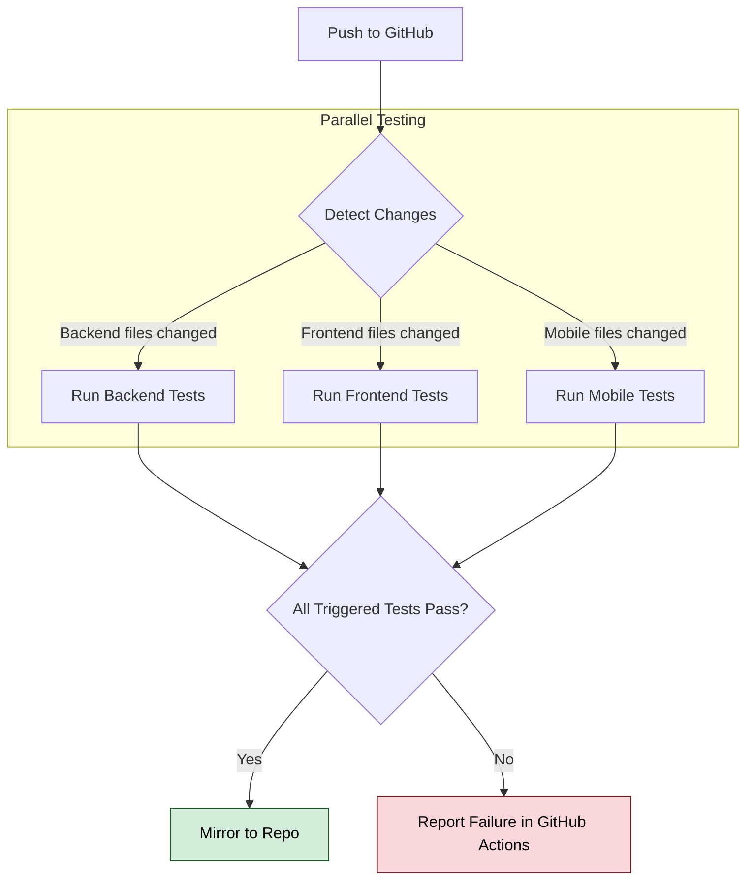

# Development and testing

This guide provides instructions for the development workflow, running tests, and contributing to the Area project.

## Development workflow

The entire development environment is managed by Docker Compose and helper scripts at the root of the project.

### Running the environment

The primary command is `./dev.sh up`. This starts the backend, web client, and database in detached mode with hot-reloading enabled. Any changes made to the source code in `back/` or `front/` will be automatically reflected in the running containers.

### Viewing logs

To view the logs for a specific service (e.g., the backend server), use:
```bash
./dev.sh logs server
```
To follow the logs in real-time, add the `-f` flag: `./dev.sh logs -f server`.

### Accessing the database

The PostgreSQL database is exposed on the host machine at the port specified by `DB_PORT` in your `.env` file. You can connect to it using any database client (like DBeaver, DataGrip, or `psql`) with the credentials from your `.env` file.

- Host: `localhost`
- Port: `${DB_PORT}` (e.g., 5432)
- User: `${DB_USER}`
- Password: `${DB_PASS}`
- Database: `${DB_NAME}`

## Testing strategy

The project includes a comprehensive test suite that can be run locally or in a CI environment.

### Running all tests locally

The `test.sh` script orchestrates all checks for the backend and the frontend in a clean, isolated Docker environment. It uses a separate configuration file, `docker-compose.test.yml`, which defines a dedicated test database to ensure tests do not interfere with development data.

To run the default test suite (build, lint, and unit tests) for the backend and frontend:
```bash
./test.sh
```

Note: By default, `./test.sh` without arguments does not include end-to-end tests. To run the complete suite, including e2e tests, use:
```bash
./test.sh all
```

To run tests for specific components or tasks, pass them as arguments:
```bash
# Run only backend unit tests
./test.sh back:unit

# Run all backend tests (lint, build, unit, e2e)
./test.sh back:all

# Run all frontend tests (lint, build, unit, e2e)
./test.sh front:all

# Run all tests in parallel
./test.sh --parallel all
```

This command executes various jobs defined in `docker-compose.test.yml`, such as linting, building, and running unit and end-to-end tests for the specified components.

### Manual testing

You can also run tests for a specific part of the application manually by entering the respective directory and using npm scripts.

Backend tests:
```bash
cd back
npm run lint
npm run test      # Unit tests
npm run test:e2e  # E2E tests (requires a running test database)
```

Frontend tests:
```bash
cd front
npm run lint
npm run test      # Unit tests
```

Note: Running end-to-end tests manually (e.g., `npm run test:e2e`) requires a properly configured test database. For a simpler and more reliable setup, use the root `test.sh` script (e.g., `./test.sh back:e2e`), which automatically provisions a temporary test database in an isolated Docker environment.

## Continuous integration (CI)

The project uses GitHub Actions for continuous integration, defined in `.github/workflows/ci.yml`. The following diagram illustrates the process that runs on every push.



On every push, the CI pipeline automatically executes the following process:

1. Detect changes: A job determines which parts of the project (backend, frontend, mobile) have been modified.
2. Run tests: Based on the changes, dedicated jobs are triggered for each affected component. These jobs use the `./test.sh` script to run a full suite of tests (linting, building, unit, and e2e) in an isolated Docker environment.
3. Mirror repository: If all tests pass, the code is automatically mirrored to a secondary repository.

This ensures that all code pushed to the repository is validated for correctness and quality, preventing regressions.

## Contribution guidelines

- Code style: The project uses ESLint and Prettier for consistent code formatting. Please run `npm run lint` and `npm run format` (in the `back/` and `front/` directories) before committing.
- Branching: Create feature branches from `main`. Once a feature is complete and tested, open a pull request back into `main`.
- New features: Any new features or bug fixes should be accompanied by relevant tests to maintain code quality.

## Contribution documentation

For more details on contributing, please refer to the following documentation:

- [Backend Developer Guide](./back/README.md)
- [Frontend Developer Guide](./front/README.md)
- [Mobile Developer Guide](./mobile/README.md)
