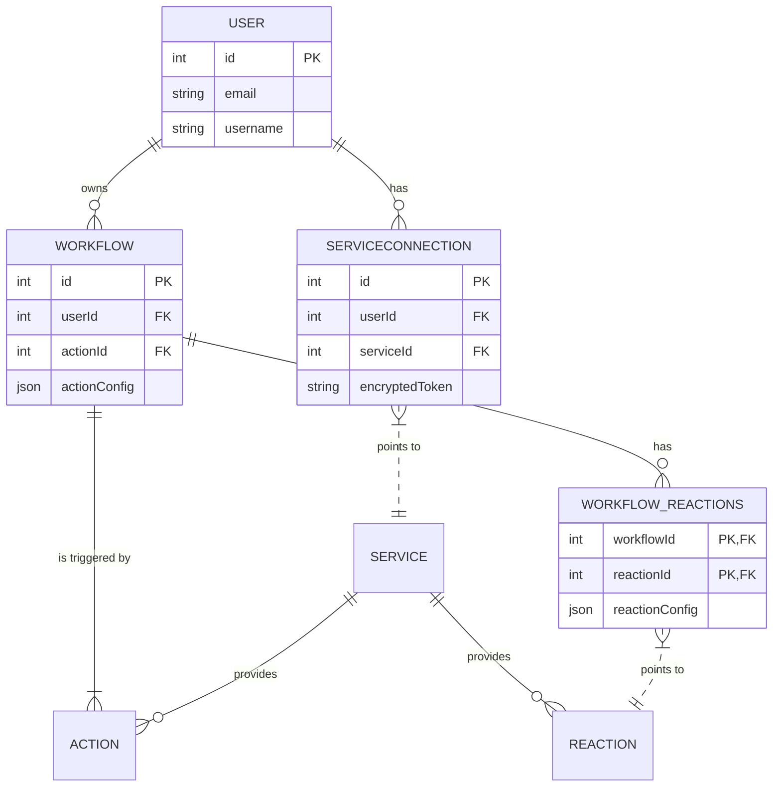

# Database using Prisma

## Schema overview

This diagram shows the relationships between the core models in the database. It is a high-level guide to how data is structured.



## Schema and client locations

- Prisma schema: `prisma/schema.prisma`
- Migrations: `prisma/migrations/` (auto-generated SQL migration folders)
- Seed script: `prisma/seed.ts`
- Prisma Client usage: `src/prisma/prisma.service.ts` (this project extends `PrismaClient` to integrate with the NestJS lifecycle)

---

## Making schema changes: a safe development workflow

This is the recommended development flow for making schema changes and applying them to your local database.

1. Edit `prisma/schema.prisma` (add/modify models, fields, enums, relations).
2. Generate and apply a migration locally:

```bash
# run from project root
npx prisma migrate dev --name add_some_field
```

`migrate dev` will:

  - Compare `schema.prisma` with the last migration.
  - Create a new SQL migration file under `prisma/migrations/<timestamp>_<name>`.
  - Apply that migration to your local database.
  - Regenerate Prisma Client if needed.

3. (Optional) Inspect the generated SQL in `prisma/migrations/<timestamp>_*/migration.sql` before committing.
4. (Optional) Regenerate Prisma Client explicitly if you manually changed a generator setting:

```bash
npx prisma generate
```

5. Run the seed script if you need initial data. The project uses a TypeScript seed script located at `prisma/seed.ts`:

```bash
# Option A: Using Prisma's db seed runner (recommended)
npx prisma db seed

# Option B: Run the seed script directly
node -r ts-node/register prisma/seed.ts
```

6. Open Prisma Studio to inspect or edit database rows in a web UI:

```bash
npx prisma studio
```

---

## Shortcuts and useful commands

- `npx prisma migrate dev --name <name>`: Create and apply a development migration.
- `npx prisma migrate deploy`: Run migrations in production (applies pending migrations only).
- `npx prisma db push`: Push the schema to the database without creating a migration (useful for rapid prototyping; not for production).
- `npx prisma generate`: Regenerate Prisma Client after schema changes.
- `npx prisma studio`: Open a GUI to browse the database.
- `npx prisma db seed`: Run the configured seed command.
- `npx prisma migrate status`: Inspect migration status.

Caveat: Prefer `migrate dev` during development and `migrate deploy` in CI/CD for production. Use `db push` only for experiments or throwaway databases.

---

## How to alter the schema safely

### Example 1: Add a new column to an existing model

1. Edit `prisma/schema.prisma` and add the field to the model:

```prisma
model User {
  id        Int    @id @default(autoincrement())
  email     String @unique
  // new field
  bio       String?
}
```

2. Create and apply the migration:

```bash
npx prisma migrate dev --name add-user-bio
```

3. Run `npx prisma generate` if the client was not regenerated automatically.
4. If you need default values for existing rows, you can carefully edit the generated SQL migration file before applying it. Always test this locally first.

### Example 2: Add a new model

1. Add the `model` to `schema.prisma`.
2. Run `npx prisma migrate dev --name add-MyModel`.
3. To seed initial rows, update `prisma/seed.ts` with `prisma.myModel.create()` or `createMany()` and run `npx prisma db seed`.

---

### Adding a new service to the database

A `Service` represents an integration like Microsoft, Google, or Discord. It groups related `Actions` (triggers) and `Reactions` (operations).

#### 1. Create the service entry

In `prisma/seed.ts`, add a new entry for the `Service` model:

```ts
const newService = await prisma.service.create({
  data: {
    name: 'slack',
    description: 'Slack integration for sending messages or reacting to events',
  }
});
```

#### 2. Add actions (triggers) for that service

```ts
await prisma.action.createMany({
  data: [
    {
      name: 'message_posted',
      description: 'Triggered when a message is posted in a channel',
      serviceId: newService.id,
      jsonFormat: {
        channel: 'string', // required field in workflow config
        text: 'string'
      }
    }
  ]
});
```

#### 3. Add reactions for that service

```ts
await prisma.reaction.createMany({
  data: [
    {
      name: 'send_message',
      description: 'Send a message to a Slack channel',
      serviceId: newService.id,
      jsonFormat: {
        channel: 'string',
        message: 'string'
      }
    }
  ]
});
```

#### 4. Implement the logic

Once the service, actions, and reactions are in the database, you must implement:

- A new `SlackService` (similar to `MicrosoftService`).
- Reaction methods (e.g., `sendMessage()`).
- A webhook or polling handler for triggers.
- A mapping in `ReactionExecutorService` to connect database reaction names with the new service methods.

---

### The `jsonFormat` field

Both `Action` and `Reaction` models contain a `jsonFormat` field that defines the expected parameters for configuring that trigger or action. These fields are used by the frontend and workflow engine to dynamically render and validate inputs.

#### Example `jsonFormat` for an Action

```json
{
  "subject": "string",
  "sender": "string"
}
```

When a user defines a workflow with this Action, the frontend will render form fields for `subject` and `sender`. When the trigger executes, it passes an object matching this shape to the workflow execution engine.

#### Example `jsonFormat` for a Reaction

```json
{
  "email": "string",
  "message": "string"
}
```

For a Reaction, these keys define what the user must supply when configuring a workflow step. When the Reaction executes, the system passes the configured data (e.g., `{ email: 'test@example.com', message: 'Hello!' }`) to the corresponding service method (e.g., `MicrosoftService.sendMail()`).

#### Important notes

- The schema does not enforce types within the JSON; it is purely descriptive and used by the application logic.
- The frontend uses this schema to build dynamic forms for users.
- You can add nested objects or arrays for more complex configurations (e.g., `{ "recipients": ["string"], "subject": "string" }`).
- During execution, the workflow runner reads this JSON definition to know which parameters to inject when invoking the action or reaction function.

---

## Data model notes

- Actions and Reactions are stored in the database (`Action`, `Reaction`, `Service`, `Workflow`, etc.). The seed script (`prisma/seed.ts`) creates the available services (GitHub, Microsoft, Google), their actions (triggers), and their reactions (operations).
- The `Workflow` model contains an `identifier` field. This field stores a unique ID provided by an external service when a webhook subscription is created (e.g., from Microsoft Graph or Twitch EventSub). It allows the backend to map an incoming webhook notification directly to the correct user's workflow.
- To add a new action (trigger) or reaction for a service, you typically need to:
  1. Add the `Action` or `Reaction` entry to the seed script or insert it via the Prisma client.
  2. Implement the runtime logic (see the [Microsoft service documentation](./services/microsoft.md) for an example of how triggers and reactions are wired).

---

## Common pitfalls and tips

- Remember to set `DATABASE_URL` in your `.env` file before running migrations.
- Keep manually edited migration files in version control; migrations are the single source of truth for the production schema.
- When changing field types in a way that requires data conversion (e.g., `String` to `Int`), prepare the necessary data migration SQL in the migration file.
- If you only want to update your database to match the schema without creating a migration file, you can use `npx prisma db push`. However, this bypasses the migration history and is not recommended for production workflows.

---
