# Architectural overview

This document provides a high-level overview of the Area platform's architecture, its core components, data models, and key operational flows.

## 1. System components

The Area platform is composed of three primary, containerized applications that work in concert:

```mermaid
graph TD
    subgraph "User Interaction"
        U[<font size=5>👤</font><br/>User] --> B[Web Client<br/><i>React</i>];
        U --> M[Mobile Client<br/><i>Android/Kotlin</i>];
    end

    subgraph "AREA Platform"
        B -- "HTTPS (REST API)" --> API[Backend<br/><i>NestJS</i>];
        M -- "HTTPS (REST API)" --> API;
        API <--> DB[(Database<br/><i>PostgreSQL</i>)];
    end

    subgraph "Third-Party Services"
        API <-- "Webhooks & OAuth" --> Ext[External Services<br/><i>Google, GitHub, etc.</i>];
    end

    style U fill:#5299d8,color:white,stroke:white
    style B fill:#b39ddb,color:white,stroke:white
    style M fill:#b39ddb,color:white,stroke:white
    style API fill:#81c784,color:white,stroke:white
    style DB fill:#666,color:white,stroke:white
    style Ext fill:#b3a121,color:white,stroke:white

    linkStyle default stroke:white,color:white,stroke-width:1px
```

1. Backend server (NestJS): The central authority of the system. It manages all business logic, including user authentication, database operations via Prisma, connections to external services (Google, GitHub), and workflow execution. It exposes a RESTful API for the clients. For more details, see the [Backend Developer Guide](../back/README.md).

2. Web client (React): A single-page application that serves as the primary user interface. It provides a rich, visual environment for users to register, log in, connect services, and build complex workflows using a drag-and-drop editor powered by ReactFlow. For more details, see the [Frontend Developer Guide](../front/README.md).

3. Mobile client (Android): A native Android application built with Jetpack Compose that offers a streamlined, on-the-go experience. It allows users to manage their workflows, connect services, and configure the server URL for connecting to different backend instances. For more details, see the [Mobile Developer Guide](../mobile/README.md).

These components communicate exclusively through the backend's [REST API](./api-reference.md). The entire stack, including a PostgreSQL database, is orchestrated by Docker Compose for consistency across environments.

## 2. Core data models

The application's data is managed by Prisma and structured around the following key models:

- `User`: Represents a registered user, containing credentials and profile information. Each user is the owner of their service connections and workflows.
- `Service`: A definition of an external service that can be integrated (e.g., "github", "gmail"). It holds a list of available actions and reactions.
- `ServiceConnection`: An association between a user and a service, storing the necessary credentials (like OAuth tokens) to act on the user's behalf.
- `Action`: A trigger event from a service (e.g., "A push is made to a repository" for GitHub).
- `Reaction`: A task to be executed in a service (e.g., "Create an issue on a repository" for GitHub).
- `Workflow`: The core entity that links a single action to one or more reactions. It stores the user's specific configuration for the action and reactions (e.g., which repository to watch, what the issue title should be).

For more details, see the [Database Documentation](../back/docs/database.md).

## 3. Key data flows

### User authentication flow (OAuth2)

This flow describes how a user connects an external service (e.g., GitHub) to their Area account. The platform uses a server-side OAuth2 flow, facilitated by a central proxy service (`p.3z.ee`) in development to handle dynamic callback URLs.

1. Initiation (Client): The user clicks "Connect" on a service. The client opens a URL to the backend's auth endpoint (e.g., `/auth/github`). If the user is already logged in, their JWT may be included as a `token` query parameter.

2. Redirect to Proxy (Backend): The backend's Passport.js strategy constructs the provider's authorization URL. It then redirects the user to the central proxy's redirect endpoint (`https://p.3z.ee/auth/redirect`). The proxy's role is to provide a stable `redirect_uri` for the OAuth provider while encoding the developer's dynamic backend URL into the `state` parameter.

3. User Consent (Provider): The user authorizes the application on the provider's site (e.g., Google, GitHub).

4. Callback to Proxy: The provider redirects the user's browser back to the proxy's callback URL (`https://p.3z.ee/auth/callback`), providing an authorization `code`.

5. Redirect to Backend (Proxy): The proxy decodes the `state` parameter to retrieve the developer's unique backend URL and redirects the user a final time to that instance, forwarding the `code` and original `state` from the client.

6. Token Exchange and Storage (Backend): The backend's callback controller receives the `code`. The Passport.js strategy securely exchanges this code for an access token and refresh token directly with the provider. The backend then creates or updates a `ServiceConnection` record in the database, linking the external service to the user's account.

7. Redirect to Client (Backend): The backend issues a JWT for the user session and redirects the user back to the frontend client (e.g., `/oauth-callback?token=...`), completing the flow.

### Workflow creation flow

1. Visual Building (Web Client): The user drags and drops nodes representing an action and one or more reactions onto the ReactFlow canvas.
2. Configuration (Web Client): The user configures each node by filling in required fields (e.g., repository name for a GitHub action, email recipient for a Gmail reaction).
3. Payload Assembly (Web Client): Upon saving, the client transforms the nodes and edges from the canvas into a structured JSON payload that matches the backend's `CreateWorkflowDto`.
4. API Request (Web Client): The client sends a `POST` request to the `/api/workflow/create` endpoint with the payload.
5. Database Creation (Backend): The backend validates the payload, creates a new `Workflow` record in the database, and establishes the relationships with the chosen action and reactions.

### Workflow execution flow (webhook)

1. External Event (Service): An event occurs in an external service, such as a push to a GitHub repository.
2. Webhook Trigger (Service): The service sends a POST request with an event payload to a central broadcast URL (`https://p.3z.ee/broadcast-webhook/...`).
3. Broadcast (Proxy): The proxy service receives the webhook. It queries the `frp` server to get a list of all currently active developer tunnels. It then forwards the original webhook request to every single active tunnel.
4. Webhook Reception (Backend): Each developer's local backend instance receives the forwarded webhook. For security, the webhook's signature is validated using a pre-shared secret to ensure it is authentic.
5. Trigger Processing (Backend): The controller passes the event to a service that finds all user workflows matching the event. For each match, it emits an event to execute the corresponding reactions.
