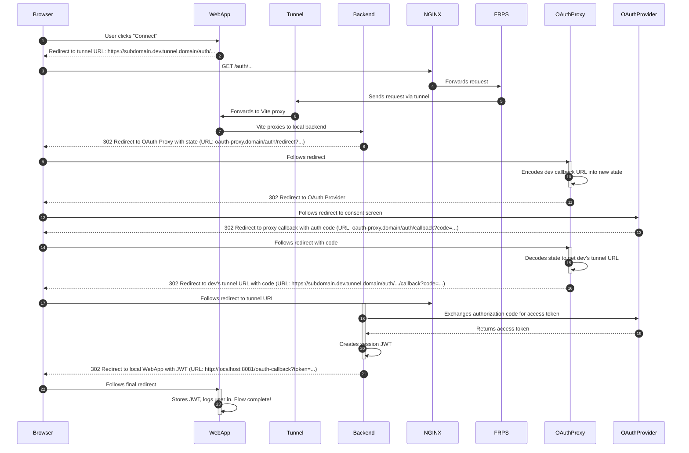

# Tunnel feature compatibility guide

## Overview

The Area project includes an optional tunneling feature that allows developers to test integrations with external services (like GitHub, Google, etc.) that require public URLs for webhooks and OAuth callbacks. When enabled, the tunnel creates a public endpoint that forwards requests to your local development environment.

## How the tunnel works

### Environment configuration

- When `TUNNEL=true` in your `.env` file, the system uses tunnel-specific URLs.
- The `.env` file contains both `_LOCAL` and `_TUNNEL` variants of important URLs.
- During startup, `dev.sh` swaps these variables in `docker/.env.run` based on the `TUNNEL` setting.

### OAuth flow with tunneling

This sequence diagram illustrates the complex "redirect dance" that occurs when authenticating with a third-party service while the development tunnel is active.



1. OAuth strategies use proxy URLs when tunneling is enabled.
2. Instead of redirecting directly to OAuth providers, requests go through an external proxy (`p.3z.ee`).
3. The proxy maintains a stable `redirect_uri` while encoding your dynamic backend URL in the `state` parameter.
4. This solves the static callback URL problem imposed by OAuth providers.

### Webhook configuration

- Services that register webhooks use proxy URLs when tunneling is enabled.
- This allows external services to reach your local development environment via a central broadcast endpoint.

## Making services compatible with the tunnel feature

### 1. Environment variables

Your service should support both local and tunnel environment variables:

```typescript
// Good practice: Support both local and tunnel variants
const backendUrl = configService.getOrThrow<string>("BACKEND_URL");
const proxyUrl = configService.get<string>("WEBHOOK_PROXY_URL");
const finalUrl = proxyUrl || backendUrl; // Use proxy when available, fallback to local
```

### 2. OAuth strategy implementation

When implementing OAuth strategies, follow this pattern:

```typescript
constructor(private configService: ConfigService) {
  const backendUrl = configService.getOrThrow<string>("BACKEND_URL");
  const proxyAuthUrl = configService.get<string>("OAUTH_PROXY_REDIRECT_URL");
  const proxyCallbackUrl = configService.get<string>("OAUTH_PROXY_CALLBACK_URL");

  super({
    clientID: configService.getOrThrow<string>("CLIENT_ID_YOUR_SERVICE"),
    clientSecret: configService.getOrThrow<string>("CLIENT_SECRET_YOUR_SERVICE"),
    callbackURL: proxyCallbackUrl || `${backendUrl}/auth/your-service/callback`, // Use proxy callback when available
    authorizationURL: proxyAuthUrl, // Use proxy auth when available
    scope: ["required", "scopes"],
  });
}

override authorizationParams(options: object): object {
  const backendUrl = this.configService.getOrThrow<string>("BACKEND_URL");
  const developerCallbackUrl = `${backendUrl}/auth/your-service/callback`;

  return {
    ...options,
    // Include your original callback URL for the proxy to use
    developer_callback_url: developerCallbackUrl,
    // Add any other required parameters
  };
}
```

### 3. Webhook registration

When registering webhooks for your service, use the proxy URL when available:

```typescript
private getWebhookUrl(): string {
  const proxyUrl = this.configService.get<string>("WEBHOOK_PROXY_URL");
  const backendUrl = this.configService.getOrThrow<string>("BACKEND_URL");
  const baseUrl = proxyUrl || backendUrl;
  return `${baseUrl}/webhooks/your-service`;
}
```

### 4. Configuration in .env.example

Add the following variables to your `.env.example` file:

```env
# Your service credentials - local
CLIENT_ID_YOUR_SERVICE_LOCAL=changeme
CLIENT_SECRET_YOUR_SERVICE_LOCAL=changeme

# Your service credentials - tunnel
CLIENT_ID_YOUR_SERVICE_TUNNEL=changeme
CLIENT_SECRET_YOUR_SERVICE_TUNNEL=changeme

# Optional: Webhook secret for local
YOUR_SERVICE_WEBHOOK_SECRET_LOCAL=changeme
# Optional: Webhook secret for tunnel
YOUR_SERVICE_WEBHOOK_SECRET_TUNNEL=changeme
```

### 5. Service registration

When registering your service in the database seeds, ensure you handle both local and tunnel configurations appropriately.

## Testing with the tunnel feature

### Local development

1. Set `TUNNEL=false` in your `.env` file.
2. Use local URLs for OAuth and webhooks.
3. External services may not be able to reach your local environment.

### Tunnel development

1. Set `TUNNEL=true` in your `.env` file.
2. Configure `FRP_SUBDOMAIN` with a unique subdomain.
3. External services can reach your development environment via the tunnel.
4. OAuth flows work with external providers.
5. Webhooks are received through the tunnel proxy.

## Best practices

1. Always support both modes: Ensure your service works in both local and tunnel modes.
2. Use environment variable patterns: Follow the `_LOCAL` and `_TUNNEL` naming convention.
3. Graceful fallbacks: When proxy URLs are not available, fall back to direct URLs.
4. Security: Use webhook secrets to validate incoming requests.
5. Testing: Test your service in both local and tunnel configurations.

## Troubleshooting

### OAuth issues

- Ensure your callback URLs are properly configured for the tunnel proxy.
- Check that the proxy is correctly encoding your backend URL in the state parameter.

### Webhook issues

- Verify that webhook URLs include the proxy when tunneling is enabled.
- Check that webhook secrets match between your service and the external provider.
