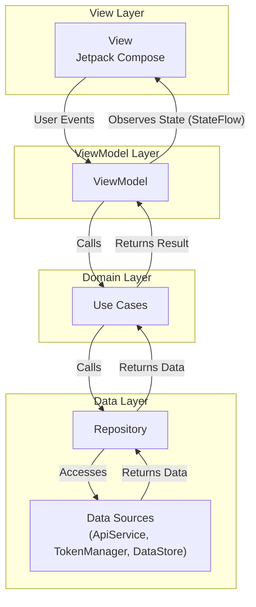

# Mobile client guide

The mobile client is a native Android application developed in Kotlin that uses modern Android development practices. It provides a focused experience for managing workflows on the go.

## 1. Architecture (mvvm)

The application follows the Model-View-ViewModel (MVVM) architectural pattern to separate concerns and improve testability. This diagram illustrates the flow of data and events between the layers.

- View (Compose UI): The UI layer, built with Jetpack Compose. Screens (`...Screen.kt`) are stateless composables that observe state from a ViewModel and delegate user events to it.
- ViewModel (`...ViewModel.kt`): The state holder for a screen. It exposes UI state via `StateFlow` and handles user actions. It interacts with the domain layer (Use Cases) to perform business logic.
- Model (Domain and Data Layers):
  - Use Cases (`domain/usecase/`): Encapsulate a single piece of business logic (e.g., `GetWorkflowsUseCase`, `GetConnectionsUseCase`).
  - Repositories (`domain/repository/` and `data/repository/`): Abstract the source of data (network or local). The `data` layer provides the implementation.
  - Data Sources: `ApiService` (Retrofit) for network calls and `DataStore`/`EncryptedSharedPreferences` for local persistence.

## 2. Dependency injection (hilt)

Dependency injection is managed by Hilt to decouple components and simplify their construction.

- `@HiltAndroidApp`: Applied to the `MyApplication` class to enable Hilt.
- `@AndroidEntryPoint`: Used on `MainActivity` to allow injection.
- `@HiltViewModel`: Used on ViewModel classes to enable injection and tie them to the navigation lifecycle.
- Modules (`di/`): Hilt modules (`NetworkModule`, `RepositoryModule`, etc.) provide instructions on how to create instances of dependencies like `OkHttpClient`, `Retrofit`, and repository implementations.

## 3. Networking and service connections

- Retrofit: Defines the REST API endpoints in the `ApiService` interface.
- OkHttp: The underlying HTTP client. It is configured with several key interceptors:
  - `AuthInterceptor`: Automatically adds the `Authorization: Bearer <TOKEN>` header to requests.
  - `DynamicBaseUrlInterceptor`: Allows the base URL of the API to be changed at runtime from the settings screen. This is a crucial feature for connecting to different server instances.
  - `TokenAuthenticator`: If an API call returns a 401 Unauthorized error, this authenticator automatically logs the user out.
- Service Connection Status: The application fetches the list of connected services from the backend (`GET /api/user/connections`). This status is displayed on the Services screen, indicating to the user which services are ready to be used in workflows. Initiating a connection opens the backend's OAuth URL in a Chrome Custom Tab for a secure and seamless user experience.

## 4. Navigation

Navigation is handled by Jetpack Navigation Compose.

- `Screen.kt`: A sealed class defines all possible navigation destinations in the app.
- `AppNavigation.kt`: The central `NavHost` composable that defines the navigation graph. It determines the starting screen (`Auth` or `Main`) based on the user's login status.

## 5. Data persistence

- Server URL: The user-configurable server URL is stored in Jetpack DataStore via `SettingsRepository`.
- Authentication Token: The JWT is stored securely using `EncryptedSharedPreferences` via the `TokenManager` class, protecting it from unauthorized access on rooted devices.

## 6. Testing

The mobile application includes unit tests and a foundation for instrumentation tests.

- Unit Tests: Located in `app/src/test/`, these tests run on a local JVM and use MockK to mock dependencies. They are essential for verifying the business logic within ViewModels and Use Cases.
- Instrumentation Tests: Located in `app/src/androidTest/`, these tests run on an Android device or emulator. They are used for UI testing with Jetpack Compose's test APIs.
- Running Tests: Tests can be run locally via the `./test.sh mobile:unit` command or directly within Android Studio. The CI pipeline automatically executes all mobile tests on every push.

Expanding test coverage, especially for UI flows and complex ViewModel logic, is a key area for future improvement (see [Roadmap](../ROADMAP.md)).

## 7. Building the APK

The `mobile/build.sh` script builds the mobile app inside a Docker container.

- Keystore Generation: The script automatically generates a signing keystore (`area.jks`) inside a Docker volume (`/keystore`) if one does not exist. The alias and passwords are read from `.env` variables (`ANDROID_KEY_ALIAS`, `ANDROID_KEY_PASS`).
- Build Process:
  1. It runs the `./gradlew :app:assembleRelease` task to build an unsigned APK.
  2. It uses `zipalign` to optimize the APK.
  3. It uses `apksigner` to sign the aligned APK with the generated keystore.
- Output: The final, signed `client.apk` is placed in the `/output` directory, which is mapped to the `apk/` folder at the project root.
